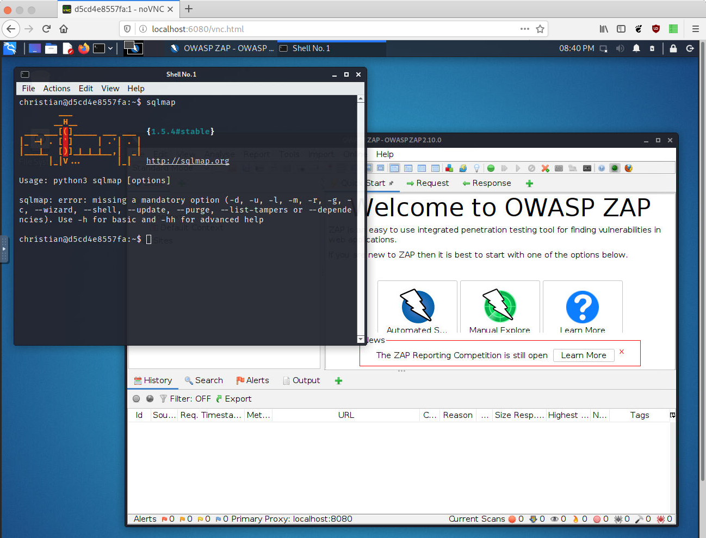

# ccharon / kali-desktop
Fork of lukaszlach/kali-desktop

Modified because the kali-desktop image that lukaszlach uses and his own image have not been updated in almost 2 years.



## Running the image
Like the original image all dependencies are included. After starting the image you can open your webbrowser at http://localhost:6080/vnc_auto.html and start.

```bash
docker run -d \
    -p 5900:5900 -p 6080:6080 \
    --privileged \
    -e RESOLUTION=1280x1024x24 \
    -e USER=${USER}\
    -e PASSWORD=kali \
    -e ROOT_PASSWORD=root \
    -v ${HOME}/kali:${HOME} \
    --name kali-desktop \
    ccharon/kali-desktop:latest
```

### Parameter
* `--network host` - optional but recommended, use the host network interfaces, if you do not need to use this option you have to manually publish the ports by passing `-p 5900:5900 -p 6080:6080`
* `--privileged` - optional but recommended
* `-e RESOLUTION` - optional, set streaming resolution and color depth, default `1280x1024x24`
* `-e USER` - optional, work as a user with provided name, default `root`
* `-e PASSWORD` - optional, provide a password for USER, default `kali`
* `-e ROOT_PASSWORD` - optional, provide password for root, default `root`
* `-v /home/kali:/home/kali` - optional, if USER was provided it is a good idea to persist user settings, work files and look-and-feel

### Exposed ports

* `5900/tcp` - VNC
* `6080/tcp` - noVNC, web browser VNC client

### Building the image
```bash
docker build -f Dockerfile -t kali-desktop:latest  .
```

## How this image works
mostly for myself as it took me a while to understand 😁

At first the kali-rolling docker image gets extended by:
- kali-desktop-xfce
- kali-tools-top10
- vnc stuff (x11vnc, xvfb and novnc)

Then the S6 init overlay gets installed. There are several scripts controlled by s6 that make this image work.

When launching a container [01-init](./etc/cont-init.d/01-init) is executed. This creates the specified user and sets the provided passwords.

After init, some service get started
1. [xvfb](./etc/services.d/xvfb/run) - xserver that does not need a graphics card, it provides a virtual framebuffer and has no real input devices

2. [gui](./etc/services.d/gui/run) starts XFCE the graphical desktop environment

3. [x11vnc](./etc/services.d/x11vnc/run) VNC Server to connect via noVNC

4. [websockify](./etc/services.d/websockify/run) translate noVNC Websocket to TCP

## Available images
See all available Docker image tags on [Docker Hub](https://hub.docker.com/r/ccharon/kali-desktop/tags/).

## License
MIT License

Copyright (c) 2018 Łukasz Lach <llach@llach.pl>

Copyright (c) 2021 ccharon

Permission is hereby granted, free of charge, to any person obtaining a copy
of this software and associated documentation files (the "Software"), to deal
in the Software without restriction, including without limitation the rights
to use, copy, modify, merge, publish, distribute, sublicense, and/or sell
copies of the Software, and to permit persons to whom the Software is
furnished to do so, subject to the following conditions:

The above copyright notice and this permission notice shall be included in all
copies or substantial portions of the Software.

THE SOFTWARE IS PROVIDED "AS IS", WITHOUT WARRANTY OF ANY KIND, EXPRESS OR
IMPLIED, INCLUDING BUT NOT LIMITED TO THE WARRANTIES OF MERCHANTABILITY,
FITNESS FOR A PARTICULAR PURPOSE AND NONINFRINGEMENT. IN NO EVENT SHALL THE
AUTHORS OR COPYRIGHT HOLDERS BE LIABLE FOR ANY CLAIM, DAMAGES OR OTHER
LIABILITY, WHETHER IN AN ACTION OF CONTRACT, TORT OR OTHERWISE, ARISING FROM,
OUT OF OR IN CONNECTION WITH THE SOFTWARE OR THE USE OR OTHER DEALINGS IN THE
SOFTWARE.
